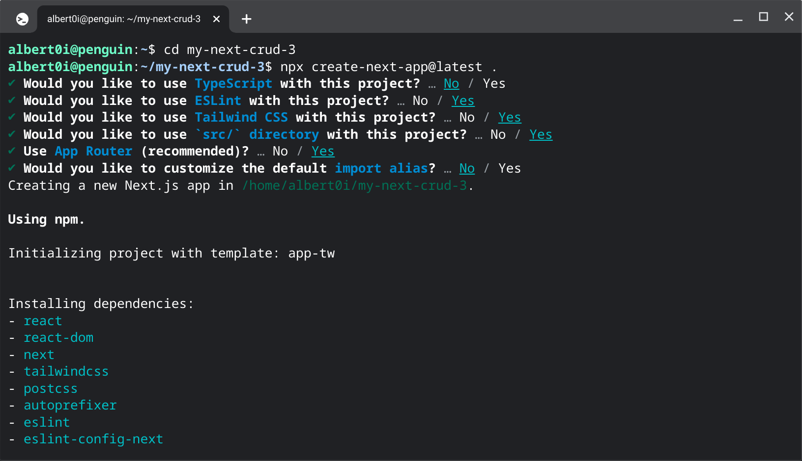

## From [Node](https://nodejs.org/en) to [NEXT](https://nextjs.org/)


<div style="text-align: left; color:white; background-color:black">
</div>


### Prologue
‘When I wish to find out how wise, or how stupid, or how good, or how wicked is any one, or what are his thoughts at the moment, I fashion the expression of my face, as accurately as possible, in accordance with the expression of his, and then wait to see what thoughts or sentiments arise in my mind or heart, as if to match or correspond with the expression.’

### I. Project setup 
With the release of [Next.js 13.4](https://nextjs.org/blog/next-13-4), two of the most appealing features are **App Router** and **Server Action**. 
- App Router enables the routing defined by the hierarchy of your folders within the app directory. 
- Server Action enables client-side javascript calling functions on server directly without needing to create an API layer in-between. 



next.config.js
```javascript
/** @type {import('next').NextConfig} */
const nextConfig = {
  experimental: {
    serverActions: true,
  },
}

module.exports = nextConfig
```


### II. REST Server


### III. App Server


### IV. Deploy with [PM2](https://pm2.keymetrics.io/)


### V. Deploy with [render.com](https://render.com/)


### VI. Summary 
[Calling an ASP.NET C# Method (Web Method) Using JavaScript](https://www.c-sharpcorner.com/UploadFile/abhikumarvatsa/calling-an-Asp-Net-C-Sharp-method-web-method-using-javascript/)


### VII. Reference
1. [Server Actions: NextJS 13.4's Best New Feature](https://youtu.be/czvSZqnpTHs)
2. [Next.js Server Actions in 15 min](https://youtu.be/g1dwTNxGmFQ)
3. [Build A Simple CRUD API With Next.js 13 App Router (REST API)](https://youtu.be/O-NGENb6LNg)
4. [NEXTjs Server Actions](https://nextjs.org/docs/app/building-your-application/data-fetching/server-actions)
5. [How to use fetch API in Next.js?](https://rapidapi.com/guides/how-to-use-fetch-api-in-next-js)
6. [How to enable cors in Nextjs 13 Route Handlers](https://github.com/vercel/next.js/discussions/47933)
7. [How to Deploy Nextjs Web Application with PM2](https://dykraf.com/blog/deploying-nextjs-web-application-with-pm2)
8. [Deploy a Next.js App](https://render.com/docs/deploy-nextjs-app)
9. [Specifying a Node Version](https://render.com/docs/node-version)
10. [The Purloined Letter](https://poemuseum.org/the-purloined-letter/)


### Epilogue 
```
```


### EOF (2023/06/26)
